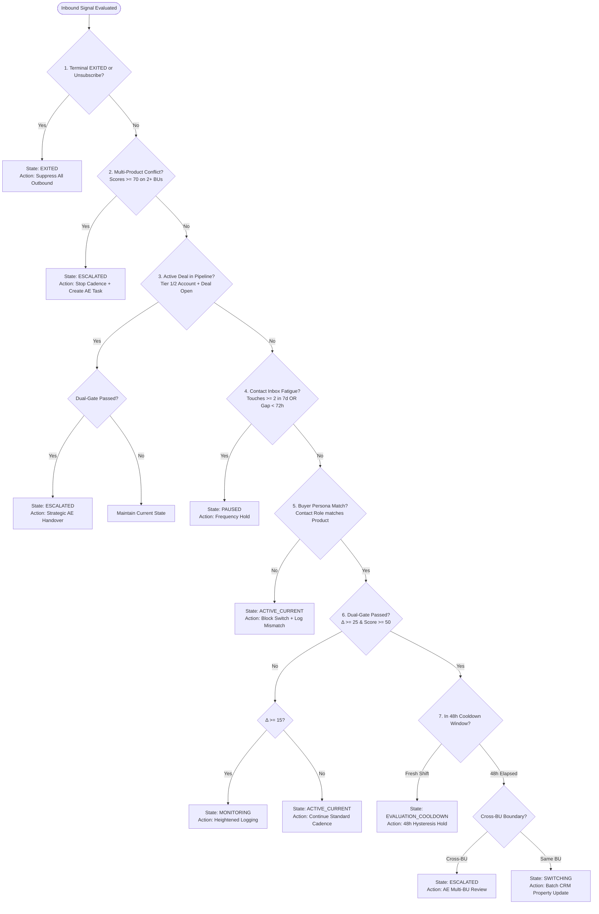
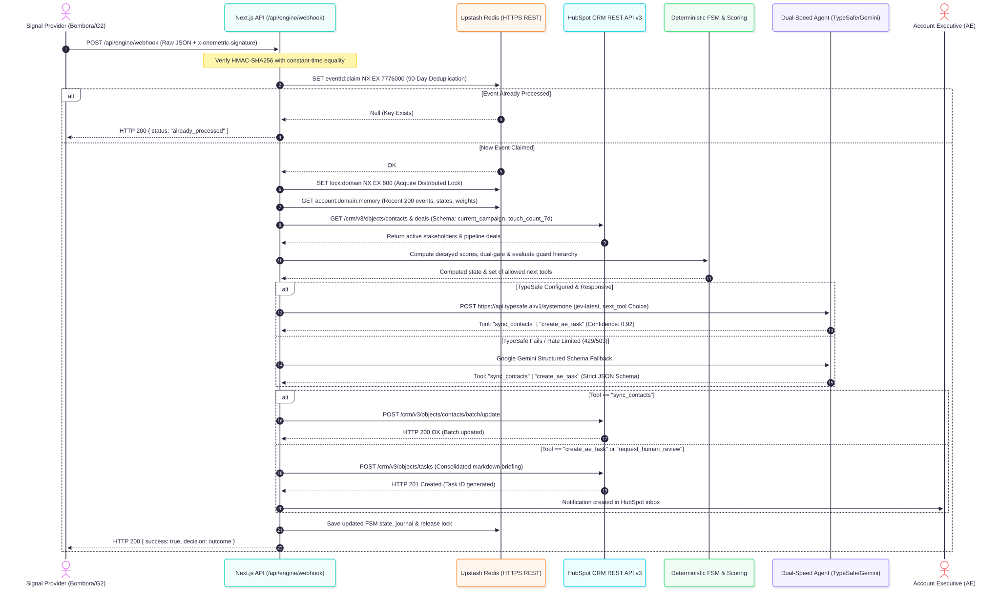

# OneMetric: Dynamic Campaign Segmentation Engine & Autonomous RevOps Agent

A production-grade RevOps decision platform and autonomous AI agent designed for **Dynamic Campaign Segmentation across Multi-Business-Unit Enterprises**.

This system resolves the core go-to-market challenge: **distinguishing meaningful, high-intent buyer shifts from volatile, noisy signals**, preventing conflicting multi-BU messaging, eliminating prospect fatigue, and orchestrating multi-stakeholder buying committees without sales rep spam.

Live Production URL: **[https://onemetric-ai-assessment.vercel.app](https://onemetric-ai-assessment.vercel.app)**

---

## Table of Contents

1. [The RevOps Challenge & Solution Overview](#the-revops-challenge--solution-overview)
2. [End-to-End System Architecture (HLD)](#end-to-end-system-architecture-hld)
3. [Decision Engine & Guard Specifications (LLD)](#decision-engine--guard-specifications-lld)
   - [Time-Decayed Signal Scoring & Multi-Touch Weighting](#1-time-decayed-signal-scoring--multi-touch-weighting)
   - [Hysteresis Dual-Gate Threshold Verification](#2-hysteresis-dual-gate-threshold-verification)
   - [Deterministic Finite State Machine (FSM) Order of Precedence](#3-deterministic-finite-state-machine-fsm-order-of-precedence)
   - [Buying Committee Multi-Stakeholder Resolution](#4-buying-committee-multi-stakeholder-resolution)
4. [Autonomous Dual-Speed AI Agent Runtime](#autonomous-dual-speed-ai-agent-runtime)
   - [TypeSafe Jev (System One) Next-Tool Selection](#typesafe-jev-system-one-next-tool-selection)
   - [Gemini Structured Fallback Planner](#gemini-structured-fallback-planner)
   - [Closed Tool Contract & CRM Idempotency](#closed-tool-contract--crm-idempotency)
5. [Downstream Learning & Continuous Feedback Loop](#downstream-learning--continuous-feedback-loop)
6. [Platform Walkthrough: Validating Real-World RevOps Decisions](#platform-walkthrough-validating-real-world-revops-decisions)
   - [1. Distinguishing Meaningful Shifts from Flapping Noise](#1-distinguishing-meaningful-shifts-from-flapping-noise-scenarios-1--2)
   - [2. Multi-Stakeholder Buying Committee Decomposition](#2-multi-stakeholder-buying-committee-decomposition-step-2)
   - [3. Persona Relevance Filtering](#3-persona-relevance-filtering-scenario-3)
   - [4. Active Deal Escalation & Cross-BU Ownership](#4-active-deal-escalation--cross-bu-ownership-scenario-4)
   - [5. Temporal Cooldown Re-Evaluation via Virtual Cron](#5-temporal-cooldown-re-evaluation-via-virtual-cron-step-3)
   - [6. Closed-Loop Learning & Dynamic Bayesian Recalibration](#6-closed-loop-learning--dynamic-bayesian-recalibration-step-4)
   - [7. Deep Analytical Inspection Panels](#7-deep-analytical-inspection-panels)
7. [Integration Boundaries, Safeguards & Limitations](#integration-boundaries-safeguards--limitations)
8. [Local Development & Verification Commands](#local-development--verification-commands)

---

## The RevOps Challenge & Solution Overview

In modern B2B organizations, enterprise prospects are targeted by multiple business units (BUs) simultaneously:
- **Product A (CloudSecure)**: Enterprise Cloud Security Platform (`BU_Security`)
- **Product B (DataFlow)**: Streaming Analytics Suite (`BU_Analytics`)
- **Product C (FinanceOS)**: Core Financial ERP (`BU_Finance`)

When a prospect actively engaged in Product B suddenly registers third-party intent surges (e.g. from Bombora or G2) for Product A, traditional marketing automation faces a dilemma:
- **Continuing the current journey** delivers irrelevant messaging and wastes high-value pipeline intent.
- **Switching immediately** creates conflicting communication, flaps across journeys on temporary noise, and disrupts active sales negotiations.

**OneMetric resolves this with a three-layer architecture:**
1. **Mathematical Scoring Layer (`scoring.ts`)**: Time-decayed half-life weighting with dampening for passive visits and a multi-source corroboration requirement.
2. **Deterministic Governance Layer (`fsm.ts` & `multi-contact-evaluator.ts`)**: Finite state machine with strict precedence guards (fatigue limits, active deal escalation, persona relevance, cross-BU ownership, and a 48-hour hysteresis window).
3. **Autonomous Bounded Agent Runtime (`agent-runtime.ts`)**: Dual-speed planner leveraging **TypeSafe Jev (System One)** for fast typed tool choices, with an automatic fallback to **Google Gemini** structured schema planning, executing idempotent CRM writes.

---

## End-to-End System Architecture (HLD)



---

## Decision Engine & Guard Specifications (LLD)



### 1. Time-Decayed Signal Scoring & Multi-Touch Weighting

Signals do not retain value forever. `src/engine/scoring.ts` applies a continuous exponential decay function with a 14-day half-life:

$$\text{Contribution}_i = \text{rawScore}_i \times \text{weight}_i \times \exp\left(-\frac{\ln(2) \times \text{ageDays}_i}{14}\right)$$

#### Baseline Source Weights
| Signal Category | Default Weight | Reliability Justification |
|---|---|---|
| **1st-Party Direct** | `1.00` | Inbound demo requests, contact forms, pricing calculator submissions. |
| **1st-Party Passive** | `0.80` | Whitepaper downloads, technical documentation, API reference views. |
| **2nd-Party Reviews** | `0.70` | G2 product comparisons, TrustRadius pricing grid views. |
| **3rd-Party Intent** | `0.50` | Bombora topic surges, 6sense cluster activity (recalibrated by feedback loop). |
| **Firmographic Fit** | `0.30` | Industry alignment, employee growth, tech stack signals. |

#### Signal Dampening & Quality Constraints
- **Same-Day Passive Dampening**: Repeated visits to the same page by the same domain on the same UTC day are dampened:
  $$\text{Dampened Score} = \sum(\text{scores}) \times \frac{\ln(1 + n)}{n}$$
- **Multi-Source Corroboration Ceiling**: If intent for a product comes from fewer than 2 distinct source types, the total accumulated score is capped at **35 points**.
- **Signal Quality Cutoffs**: Signals older than 30 days, future-dated timestamps, or signals decaying below 10 points are discarded.

---

### 2. Hysteresis Dual-Gate Threshold Verification

To prevent the **Zero-Baseline Trap** (where a fresh prospect with 0 baseline points is flipped by an unverified 3rd-party spike of 30 points), the engine enforces two simultaneous mathematical gates:

```text
1. Relative Hysteresis Gap:  CompetingScore - CurrentScore >= 25.0 pts
2. Absolute Confidence Floor: CompetingScore >= 50.0 pts
```

Both gates must evaluate to `TRUE` for a prospect to leave `ACTIVE_CURRENT`. If relative gap passes but absolute floor fails, the engine enters `MONITORING` mode without disrupting communications.

---

### 3. Deterministic Finite State Machine (FSM) Order of Precedence

The FSM (`src/engine/fsm.ts`) is authoritative. Machine learning models and LLM planners **cannot bypass FSM transitions or safety guards**. Guards are evaluated in strict priority order:





---

### 4. Buying Committee Multi-Stakeholder Resolution

Intent signals arrive at the **Account Domain level** (e.g. `techcorp.com`, `snowflake.com`, `stripe.com`), but campaign touches target **individual human stakeholders**.

`src/engine/multi-contact-evaluator.ts` reads the complete buying committee and resolves concurrent journeys concurrently:
1. **VP of Engineering / Security**: Routes to **CloudSecure** (`product_a`).
2. **Head of Data / Data Platform Lead**: Routes to **DataFlow** (`product_b`).
3. **CFO / VP of Finance**: Routes to **FinanceOS** (`product_c`).
4. **Account Executive Escalation**: If multiple committee members show cross-product surges or an active deal exists, the agent generates **one single consolidated AE task** associated with all contacts, preventing sales rep collision.

---

## Autonomous Dual-Speed AI Agent Runtime



The agent runtime (`src/engine/agent-runtime.ts`) follows a bounded, deterministic-first cycle:
1. Observes account state and historical intent events from Upstash Redis.
2. Executes pure FSM transition and computes valid available tools.
3. Requests next-tool execution from the planner.
4. Executes the chosen tool against CRM REST endpoints.
5. Loops until the terminal `complete` tool is selected or human escalation occurs.

### TypeSafe Jev (System One) Next-Tool Selection
- Calls `POST https://api.typesafe.ai/v1/systemone` using model `jev-latest`.
- Supplies available tools as an enumerated `Choice` question with strict transition criteria.
- Validates returned confidence; if confidence falls below `0.65`, human review is triggered automatically.

### Gemini Structured Fallback Planner
If TypeSafe Jev is unconfigured, times out, or encounters rate limits (HTTP 429/503), the engine seamlessly hands off execution to **Google Gemini** (`src/engine/gemini-agent.ts`):
- Uses strict JSON schema enforcement:
  ```json
  {
    "type": "OBJECT",
    "properties": {
      "tool": { "type": "STRING", "enum": ["sync_contacts", "create_ae_task", "request_human_review", "complete"] },
      "confidence": { "type": "NUMBER" },
      "reasoning": { "type": "STRING" }
    },
    "required": ["tool", "confidence", "reasoning"]
  }
  ```
- Tries configured model (`gemini-3.5-flash`), configured fallback (`gemini-flash-lite-latest`), and stable production endpoints without infinite loops.

### Closed Tool Contract & CRM Idempotency
| Tool Name | Preconditions | Side Effect |
|---|---|---|
| `sync_contacts` | Contact properties need updating | Executes `/crm/v3/objects/contacts/batch/update` with idempotency key. |
| `create_ae_task` | Account escalated or multi-BU conflict | Executes `/crm/v3/objects/tasks` with consolidated markdown briefing. |
| `request_human_review` | Low model confidence (< 0.65) or FSM conflict | Creates review task in HubSpot and marks account for human intervention. |
| `complete` | Required CRM writes succeeded | Terminal tool; closes session and writes final audit journal. |

---

## Downstream Learning & Continuous Feedback Loop



The platform includes a real-time closed-loop learning mechanism (`POST /api/engine/feedback`):
- Accepts server-to-server HMAC-SHA256 signed outcome events.
- Calibrates 3rd-party source weights dynamically based on business outcomes:

| Outcome Event | Weight Adjustment ($\Delta$) | Business Rationale |
|---|---|---|
| **Meeting Booked** | `+0.08` | Strong positive signal corroboration; intent converted to pipeline. |
| **Email Reply** | `+0.05` | Positive engagement; recipient found messaging relevant. |
| **Deal Closed-Won** | `+0.08` | Definitive revenue proof of campaign attribution. |
| **Deal Lost (Timing)** | `-0.05` | Indicates potential false-positive intent surge. |
| **Unsubscribed** | `-0.08` | Severe negative feedback; signal misread prospect context. |

All weights are bounded within `[0.10, 1.00]` and immediately affect future scoring calculations for that domain.

---

## Platform Walkthrough: Validating Real-World RevOps Decisions

The interactive dashboard at **[https://onemetric-ai-assessment.vercel.app](https://onemetric-ai-assessment.vercel.app)** allows full observability and testing of all decision engine mechanics.

```text
┌─────────────────────────────────────────────────────────────────────────────────────────┐
│                                 ONEMETRIC REVOPS ENGINE                                 │
├─────────────────────────────────────────────────────────────────────────────────────────┤
│ [Header] Reset Engine | Guide | Engine Status (TypeSafe Jev + Gemini Fallback) | Latency │
├─────────────────────────────────────────────────────────────────────────────────────────┤
│ [Top Evaluator Bar]                                                                     │
│  Domain Input: [ techcorp.com ]  [ Evaluate Committee ]                                │
│  Quick 1-Click: [Evaluate techcorp.com] [Evaluate snowflake.com] [Advance 48h (Cron)]  │
├─────────────────────────────────────────────────────────────────────────────────────────┤
│ [Learning Loop Bar]                                                                     │
│  Live Bombora Weight: 0.58  | Downstream Feedback: [+ Meeting] [+ Reply] [- Lost]      │
├─────────────────────────────────────────────────────────────────────────────────────────┤
│ [3-Column Simulation Grid]                                                              │
│  1. Prospect & Account Profile   2. Finite State Visualizer   3. Intent Scenarios       │
│     (Tier, BU, Active Score)        (Live 6-Node Graph)          (Scenarios 1, 2, 3, 4) │
├─────────────────────────────────────────────────────────────────────────────────────────┤
│ [Deep Tabbed Inspector]                                                                 │
│  [Decision & Guards] [Buying Committee] [Sales Briefing] [CRM Payloads] [Audit Log]   │
└─────────────────────────────────────────────────────────────────────────────────────────┘
```

### 1. Distinguishing Meaningful Shifts from Flapping Noise (Scenarios 1 & 2)

A primary failure mode in third-party intent automation (e.g. Bombora topic surges) is **the Zero-Baseline Trap**: if an account has zero active intent for Product A, a single uncorroborated event can produce an artificial relative gap ($\Delta = 35 - 0 = 35$), which naive thresholding would mistakenly interpret as a major buying surge.

- **Scenario 1: Uncorroborated Surge (Zero-Baseline Trap)**:
  - *Context*: A prospect in Product B (`DataFlow`) registers an isolated Bombora surge for Product A (`CloudSecure`). No first-party or second-party corroboration exists.
  - *Mathematical Check*: The single-source cap restricts the raw score to $35$ points. While the relative delta requirement ($\Delta \ge 25$) is satisfied, the **Absolute Floor Guard** ($\text{Score} \ge 50$) safely rejects the shift.
  - *Engine Verdict*: FSM holds the contact in `ACTIVE_CURRENT`. Automation continues Product B nurturing without disruptive flapping.

- **Scenario 2: Corroborated Buying Intent with 48h Cooldown Hold**:
  - *Context*: The account registers multi-touch corroboration across high-intent channels (direct documentation visits + G2 competitive comparison + Bombora surge for Product A).
  - *Mathematical Check*: Combined decayed score reaches $100$, surpassing both the delta requirement ($\Delta = 65 \ge 25$) and the absolute floor ($100 \ge 50$).
  - *Engine Verdict*: Rather than abruptly switching campaigns mid-sequence, the FSM transitions to `EVALUATION_COOLDOWN` (48-hour hold). This prevents erratic messaging, protects ongoing campaign cadence, and queues the account for temporal re-verification.

### 2. Multi-Stakeholder Buying Committee Decomposition (Step 2)

Intent data is collected at the domain level (e.g. `techcorp.com`), but campaign journeys and cold outreach execute on individual human contacts. Blindly switching all domain contacts to a new product creates catastrophic messaging mismatch.

- *Decomposition Logic*: When evaluating an account committee (e.g. `techcorp.com`, `snowflake.com`, `stripe.com`), the engine parses all CRM contacts and maps incoming product surges strictly to their operational buyer personas:
  - **VP Engineering / SecOps**: Mapped to `CloudSecure` (Product A) — relevant to infrastructure security.
  - **Head of Data / Chief Architect**: Mapped to `DataFlow` (Product B) — relevant to streaming pipelines.
  - **VP Finance / CFO**: Mapped to `FinanceOS` (Product C) — relevant to ERP and billing.
- *Consolidated AE Orchestration*: If multiple committee members express conflicting or simultaneous interest across business units, the engine creates **exactly one consolidated AE briefing task** in HubSpot, linking all involved contacts, rather than firing multiple competing outreach cadences.

### 3. Persona Relevance Filtering (Scenario 3)

- *Context*: Third-party intent surges on FinanceOS (Product C), but the evaluated contact is an Engineering Director currently enrolled in DataFlow (Product B).
- *Engine Verdict*: The **Buyer Persona Guard** intervenes. While domain-level intent for Product C is legitimate ($92.28$), enrolling an engineering buyer in financial software messaging would severely damage brand trust. The contact remains in `ACTIVE_CURRENT`, and the engine flags a recommendation to source an appropriate finance buyer persona in CRM.

### 4. Active Deal Escalation & Cross-BU Ownership (Scenario 4)

- *Context*: A Tier-1 enterprise account exhibits a surge in Product A, but CRM reconciliation discovers an active pipeline deal ($120,000, Stage: *Demo Scheduled*) owned by an assigned Account Executive.
- *Engine Verdict*: Deterministic FSM guard `ACTIVE_DEAL_CHECK` immediately takes precedence over marketing automation. Automated campaign switching is frozen, status moves to `ESCALATED`, and an automated **Sales Executive Briefing Memo** is synthesized via Gemini, providing the AE with commercial risk assessments, talking points, and discovery questions before customer calls.

### 5. Temporal Cooldown Re-Evaluation via Virtual Cron (Step 3)

The 48-hour cooldown is not a static delay; it is an active noise filter:
- *Virtual Cron Execution (`/api/engine/cron/evaluate-cooldowns`)*: In production, daily Vercel cron triggers recheck workers. In the dashboard, clicking **Advance 48h Cooldown (Cron)** simulates the 48-hour temporal progression using an injected virtual clock.
- *Decay Dynamics*: Continuous exponential decay ($t_{1/2} = 14$ days) re-evaluates signals. Persistent signals (backed by ongoing engagement) pass re-verification and graduate to `SWITCHING` (same BU) or `ESCALATED` (cross BU). Transient noise naturally decays below the 50-point floor and cleanly reverts the prospect to `ACTIVE_CURRENT`.

### 6. Closed-Loop Learning & Dynamic Bayesian Recalibration (Step 4)

The platform does not treat third-party data providers as infallible. Inbound intent sources are continuously calibrated against downstream conversion outcomes:
- *Ingestion Endpoint*: Secure server-to-server webhook (`POST /api/engine/feedback`) receives signed outcomes (`meeting_booked`, `email_reply`, `deal_won`, `deal_lost`, `unsubscribed`).
- *Weight Updating*: Applies bounded adjustments to provider reliability weights in durable Redis memory (e.g. Bombora intent weight adjusts from $0.50 \to 0.58$ upon meeting booking, or drops upon unsubscription).
- *System Impact*: Accounts from that provider in the future require either higher corroboration or lower barriers depending on historical predictive accuracy.

### 7. Deep Analytical Inspection Panels

- **Decision & Guard Analysis**: Step-by-step mathematical breakdown of exponential decay, same-day passive dampening, dual-gate hysteresis, and individual FSM guard pass/fail conditions.
- **Buying Committee Resolution**: Role-by-role stakeholder grid showing assigned actions, persona mappings, and external digital footprint corroboration.
- **Sales Executive Briefing**: Strategic memo synthesized for sales reps, containing deal risk assessment, cross-BU positioning strategies, and actionable qualification questions.
- **HubSpot CRM Sync Payloads**: Copyable, syntax-highlighted REST API v3 payloads for Contact PATCH, Batch Updates, and Task Creation with HMAC idempotency headers.
- **System Audit Ledger**: Immutable chronological execution log capturing raw webhook IDs, transition decisions, planner selection, and sub-millisecond execution latencies.

---

## Integration Boundaries, Safeguards & Limitations

| Integration Point | Implementation Status | Safety Safeguards Enforced |
|---|---|---|
| **HubSpot Contacts API** | Live REST v3 batch updates | Custom property validation (`current_campaign`, `touch_count_7d`). Fails closed on missing counters. |
| **HubSpot Tasks API** | Live REST v3 creation | Creates exactly one consolidated AE briefing task per account escalation; eliminates duplicate rep spam. |
| **HubSpot Sequences API** | Evaluated (UI-only scope) | Sequences API requires user-level OAuth seats. The engine marks campaigns in CRM but delegates automated sending to verified workflows. |
| **Upstash Redis Storage** | Live HTTPS REST | 90-day deduplication claims, distributed lock serialization (`SET NX EX`), and persistent event history. |
| **TypeSafe Jev (System One)** | Live REST API | Evaluated against model `jev-latest`. Automated fallback to Gemini on timeout, rate limit, or failure. |
| **Google Gemini API** | Live REST API | Structured JSON schema output fallback with 0.65 confidence safety threshold. |

---

## Local Development & Verification Commands

```bash
# 1. Install dependencies
npm install

# 2. Run local development server
npm run dev

# 3. Execute strict TypeScript typecheck
npm run typecheck

# 4. Run deterministic RevOps engine scenario CLI tests
npm run test:engine

# 5. Build production Next.js bundle
npm run build
```

---

## Authors & Architectural Record

Built by the OneMetric RevOps Engineering Team. For architectural invariants, FSM transition tables, and strict change boundaries, consult [`AGENTS.md`](AGENTS.md).
