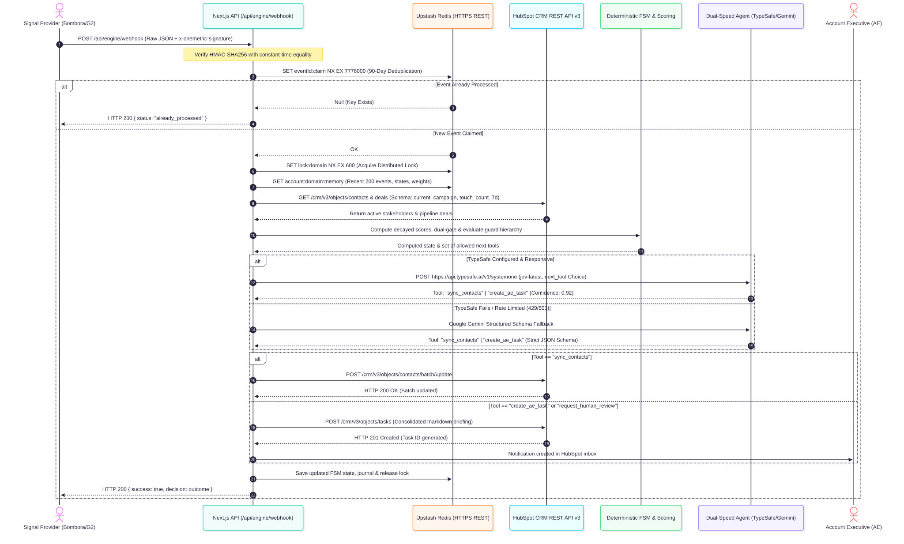

# OneMetric: Dynamic Campaign Segmentation Engine & RevOps Decision Platform

> **The Intelligent Traffic Controller for Enterprise Go-To-Market.**  
> Automatically detects meaningful buyer intent shifts, eliminates campaign flapping, protects active enterprise pipeline deals, and orchestrates multi-stakeholder buying committees without spamming prospects.

Live Production URL: **[https://onemetric-ai-assessment.vercel.app](https://onemetric-ai-assessment.vercel.app)**  
Repository: **[https://github.com/bhaktofmahakal/onemetric-ai-assessment](https://github.com/bhaktofmahakal/onemetric-ai-assessment)**

---

## Executive Summary: The Multi-Product RevOps Dilemma

In modern B2B enterprises selling multiple product lines (e.g. Cloud Security, Streaming Analytics, Financial ERP), prospective accounts are targeted by multiple business units (BUs) simultaneously.

```
       ┌─────────────────┐       ┌─────────────────┐       ┌─────────────────┐
       │   CloudSecure   │       │    DataFlow     │       │    FinanceOS    │
       │ (Security BU)   │       │ (Analytics BU)  │       │  (Finance BU)   │
       └────────┬────────┘       └────────┬────────┘       └────────┬────────┘
                │                         │                         │
                └────────────────► ◄──────┴──────► ◄────────────────┘
                                          │
                           ENTERPRISE BUYING COMMITTEE
                       (VP Eng, CISO, Data Lead, CFO)
```

### The Three Critical Failure Modes in Traditional Automation
1. **The False-Alarm Trap (Flapping Noise):** An isolated third-party intent spike (e.g. a junior engineer casually browsing G2 or Bombora) flips a prospect out of an active nurture campaign into a new one, causing erratic, confusing messaging.
2. **The Deal-Collision Disaster:** An Account Executive has an active **$120,000 deal** in late-stage demo with the CISO. An uncoordinated marketing automation detects general interest in an analytics product and blasts the account with conflicting pricing or entry-level pitches, derailing the sales cycle.
3. **Persona-Level Messaging Mismatch:** Account-level domain intent surges on financial software, but the CRM blindly enrolls the VP of Engineering in accounting software emails, driving immediate unsubscriptions.

**OneMetric solves this with a simple operational philosophy:**  
> **"Deterministic Business Guardrails First, Autonomous Reasoning Second."**

---

## Core Product Capabilities at a Glance

| Capability | How OneMetric Solves It | Business Impact |
|---|---|---|
| **Multi-Source Corroboration** | Requires evidence across ≥2 distinct channels (1st-party web, 2nd-party G2, 3rd-party Bombora, and live TinyFish web research). Single sources are capped at 35 points. | Eliminates false switches caused by vendor noise. |
| **Dual-Gate Hysteresis** | An intent switch requires both a **relative separation gap (Δ ≥ 25 pts)** AND an **absolute confidence floor (Score ≥ 50 pts)**. | Stops weak, zero-baseline flips cold. |
| **Anti-Spam Fatigue Cap** | Hard cadence limiter: max 2 touches in 7 days, minimum 72-hour spacing between touches. | Protects prospect inbox trust and domain reputation. |
| **Active Deal Protection** | Reconciles active CRM pipeline deals before any automated campaign touch is scheduled. | Safeguards open ARR ($120k+) from marketing interference. |
| **48-Hour Cooldown Filter** | High-intent surges enter a 48-hour observation hold to verify buyer interest is sustained before changing journeys. | Prevents knee-jerk campaign switching. |
| **Buying Committee Orchestration** | Decomposes domain-level intent across job titles (VP Eng → Security, Data Lead → Analytics, CFO → Finance). | Every stakeholder gets only relevant messaging. |
| **AI Sales Briefing Memo** | When an active deal conflict arises, Gemini synthesizes a commercial risk briefing, talking points, and discovery questions for the AE. | Empowers sales reps with strategic account intelligence. |
| **Closed-Loop Feedback** | Downstream conversion outcomes (`+ Meeting Booked`, `− Unsubscribed`) dynamically recalibrate provider reliability weights. | The engine continuously gets smarter from real sales data. |

---

## High-Level Product & System Architecture



### The 3-Stage Decision Pipeline
1. **Signal Intake & Time Decay (`scoring.ts`):** Ingests events from webhooks, applies 14-day exponential half-life decay, and dampens repetitive same-day passive visits.
2. **Deterministic Governance (`fsm.ts` & `multi-contact-evaluator.ts`):** Evaluates 5 safety guards in strict priority order. FSM transitions are mathematically binding — AI models cannot bypass them.
3. **Bounded Agent Runtime (`agent-runtime.ts`):** Evaluates allowable actions, uses **TypeSafe Jev (System One)** for fast probabilistic planning with automatic fallback to **Google Gemini**, and stages idempotent HubSpot CRM batch updates.

---

## Detailed Decision Engine & Safety Guards (LLD)



### 1. Mathematical Scoring & Exponential Time Decay
Signals lose relevance as time passes. `src/engine/scoring.ts` applies continuous exponential decay with a 14-day half-life:

$$\text{Contribution}_i = \text{rawScore}_i \times \text{weight}_i \times \exp\left(-\frac{\ln(2) \times \text{ageDays}_i}{14}\right)$$

#### Default Source Reliability Weights
- **1st-Party Direct (1.00):** Contact forms, pricing calculator submissions, demo requests.
- **1st-Party Passive (0.80):** Whitepaper downloads, documentation, API reference views.
- **2nd-Party Reviews (0.70):** G2 product comparisons, TrustRadius pricing grid views.
- **3rd-Party Intent (0.50):** Bombora topic surges, 6sense intent clusters (dynamically tuned by feedback loop).
- **Firmographic Fit (0.30):** Industry match, company employee size, revenue tier.

#### Noise Suppression Guardrails
- **Same-Day Passive Dampening:** Repeated visits to the same page by the same domain on the same UTC day scale logarithmically: $\sum \text{scores} \times \frac{\ln(1+n)}{n}$.
- **Single-Source Cap (35 pts):** If signals for a product come from only one source type, score is capped at 35 points (below the 50-point transition floor).
- **Signal Discard:** Signals older than 30 days, future-dated timestamps, or decayed under 10 points are discarded.

---

### 2. Dual-Gate Threshold Verification
To eliminate the **Zero-Baseline Trap** (where a fresh prospect with 0 baseline points is flipped by an unverified 3rd-party spike of 30 points), the engine enforces two simultaneous mathematical conditions:

```text
1. Relative Hysteresis Gap:  CompetingScore - CurrentScore >= 25.0 pts
2. Absolute Confidence Floor: CompetingScore >= 50.0 pts
```

If the relative gap is met but the absolute floor is below 50, the engine moves the account to **`MONITORING`** mode — tracking the shift without disrupting the live campaign.

---

### 3. FSM Guard Precedence Hierarchy

The state machine (`src/engine/fsm.ts`) executes a strict priority order where deal safety always outranks campaign automation:



1. **`EXITED` Terminal Check:** Inactive or exited contacts are skipped.
2. **`EXIT_SIGNAL` Check:** Global opt-out or explicit unsubscribe immediately suppresses outreach.
3. **`ACTIVE_DEAL_CHECK`:** If an active sales opportunity exists, automation halts and moves to `ESCALATED`.
4. **`FATIGUE_CAP`:** If 2 touches in 7 days or last touch < 72 hours, sequence pauses (`PAUSED`).
5. **`DUAL_GATE`:** Absolute floor (≥ 50) and relative delta (≥ 25) must pass.
6. **`PERSONA_ALIGNMENT`:** Contact job title must match target product buyer persona.
7. **`COOLDOWN_GATE`:** High-intent shifts enter `EVALUATION_COOLDOWN` for 48 hours to confirm signal persistence.

---

### 4. Buying Committee Multi-Stakeholder Resolution

Intent surges occur at the **company domain level** (e.g. `snowflake.com`), but emails reach individual people. Blindly switching all contacts at an account to a single product creates chaos.

`src/engine/multi-contact-evaluator.ts` reads the entire buying committee and resolves concurrent journeys:
- **VP of Engineering / SecOps** → Routed to **CloudSecure** (Security Platform).
- **Head of Data / Data Platform Lead** → Routed to **DataFlow** (Analytics Suite).
- **CFO / VP Finance** → Routed to **FinanceOS** (Financial ERP).
- **AE Escalation:** If multiple stakeholders surge simultaneously or an active deal exists, the engine generates **one consolidated AE task** linking all stakeholders, preventing rep collisions.

---

## Autonomous Dual-Speed AI Agent Runtime



The agent runtime (`src/engine/agent-runtime.ts`) follows a bounded, deterministic-first cycle:
1. Reads account state and intent history from Upstash Redis.
2. Executes the deterministic FSM and derives the list of valid, safe tools.
3. Requests next-tool execution from the planner:
   - **Primary Planner:** **TypeSafe Jev (System One)** (`POST https://api.typesafe.ai/v1/systemone`, model `jev-latest`) executes in < 1ms with typed choice selection.
   - **Fallback Planner:** **Google Gemini** (`gemini-3.5-flash` / `gemini-flash-lite-latest`) with strict JSON schema constraints. Confidence < 0.65 automatically requests human review.
4. Executes the selected tool against CRM REST endpoints with idempotency headers.
5. Concludes only when the terminal `complete` tool is reached or human escalation is confirmed.

---

## Downstream Learning & Continuous Feedback Loop



Third-party intent providers are not treated as static truth. Inbound intent sources are continuously calibrated against downstream conversion outcomes (`POST /api/engine/feedback`):

| Downstream Event | Reliability Adjustment ($\Delta$) | Operational Rationale |
|---|---|---|
| **Meeting Booked** | `+0.08` | Proven positive intent corroboration; campaign successfully generated pipeline. |
| **Email Reply** | `+0.05` | Positive engagement; recipient found message relevant. |
| **Deal Closed-Won** | `+0.08` | Ultimate commercial validation of intent attribution. |
| **Deal Lost (Timing)** | `-0.05` | Signal produced false urgency; down-weight provider. |
| **Unsubscribed** | `-0.08` | Severe negative signal; message disrupted prospect. |

All source weights are bounded between `[0.10, 1.00]` in persistent Redis storage, dynamically improving future scoring accuracy.

---

## Interactive Dashboard Walkthrough

The live dashboard at **[https://onemetric-ai-assessment.vercel.app](https://onemetric-ai-assessment.vercel.app)** is built on **Progressive Disclosure** — providing executive clarity in the first 3 seconds while keeping deep engineering inspection accessible in one click.

### 1. Executive Hero View (First 3 Seconds)
The top Hero card immediately answers three critical business questions:
- **Decision:** *What did the engine decide?* (e.g. `Continue Current Journey` or `Escalate to Sales`)
- **Rationale:** *Why did this happen?* (e.g. *Held by Absolute Floor* or *Active $120k Deal Conflict*)
- **Business Impact:** Displays the active **Account Domain**, **Lead Contact & Title**, **Journey State**, and highlighted **Deal Protected ($120k)** badge.

### 2. Live Account Evaluation
- Search any company domain (e.g. `stripe.com`, `snowflake.com`, `techcorp.com`).
- The engine fetches buying committee stakeholders, runs live **TinyFish web research** to corroborate intent with public hiring and market signals, and previews the HubSpot CRM batch payload.

### 3. The 4 Benchmark Scenarios (Click to Run)
1. **Uncorroborated Surge (Scenario 1):** Tests an isolated Bombora surge against an empty baseline. Proves that the single-source cap (35 pts) prevents premature campaign switching.
2. **Corroborated Buying Intent (Scenario 2):** Tests multi-source corroboration across G2 reviews and website visits. Enters 48h Cooldown hold. Clicking **Skip 48h Cooldown** demonstrates the re-evaluation and campaign switch.
3. **Cross-Department Inquiry (Scenario 3):** Tests domain-level interest in Finance software when the contact is an Engineering VP. Proves the Buyer Persona Guard holds the nurture journey.
4. **Enterprise Account Conflict (Scenario 4):** Tests high intent on an account with an active $120,000 deal. Freezes marketing automation and displays the Gemini AI strategic sales briefing memo for the AE.

### 4. Deep Analysis Collapsibles (Hidden Until Clicked)
- **Decision Logic:** Full mathematical formula breakdown, Dual-Gate verification, and Jev action probability distribution.
- **Buying Committee:** Stakeholder role mapping, cadence limits, and TinyFish live hiring search tags.
- **Sales Briefing:** Gemini System Two commercial risk assessment, unified cross-solution strategy, and AE discovery checklist.
- **CRM Sync:** Syntax-highlighted HubSpot REST batch update and task payloads with HMAC idempotency.
- **Audit Log:** Chronological immutable ledger of all evaluation cycles.

---

## Integration Boundaries & Safeguards

| Component | Implementation Status | Safety Safeguards Enforced |
|---|---|---|
| **HubSpot Contacts API** | Live REST v3 batch updates | Custom property schema check (`current_campaign`, `touch_count_7d`). Fails closed on missing counters. |
| **HubSpot Tasks API** | Live REST v3 creation | Creates exactly one consolidated AE briefing task per account escalation; eliminates duplicate rep spam. |
| **HubSpot Sequences API** | Evaluated (UI-only scope) | Sequences API requires user-level OAuth seats. The engine marks campaigns in CRM but delegates automated sending to verified workflows. |
| **TinyFish Web Corroborator** | Live Web Search API | Cralws public hiring and market signals (`api.search.tinyfish.ai`) to verify domain intent before state transitions. |
| **Upstash Redis Storage** | Live HTTPS REST | 90-day deduplication claims, distributed lock serialization (`SET NX EX`), and persistent account memory. |
| **TypeSafe Jev (System One)** | Live REST API | Evaluated against model `jev-latest`. Automated fallback to Gemini on timeout, rate limit, or failure. |
| **Google Gemini API** | Live REST API | Structured JSON schema output fallback with 0.65 confidence safety threshold. |

---

## Verification & Commands

```bash
# 1. Install dependencies
npm install

# 2. Run local development server
npm run dev

# 3. Execute strict TypeScript typecheck
npm run typecheck

# 4. Run deterministic RevOps engine scenario CLI tests
npm run test:engine

# 5. Build production Next.js bundle
npm run build
```

---

## Repository Guidelines & Architecture Invariants

For strict architectural boundaries, FSM guard orders, and database retention policies, consult [`AGENTS.md`](AGENTS.md).
